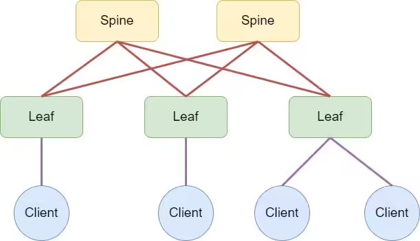
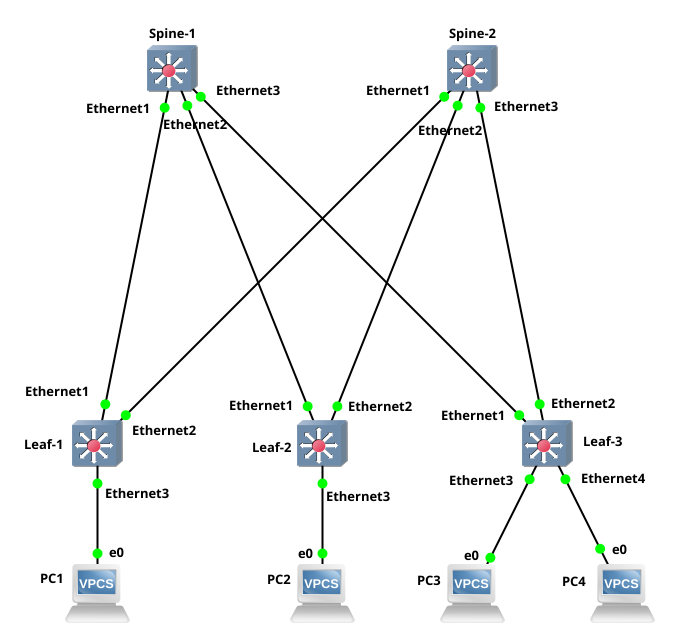

# Построение Underlay сети (OSPF) в архитектуре Leaf-Spine

Этот репозиторий содержит конфигурационные файлы и документацию для построения Underlay-сети с использованием протокола OSPF в архитектуре Leaf-Spine.

## 1. Топология сети

Архитектура состоит из 2-х Spine коммутаторов и 3-х Leaf коммутаторов.
- К `leaf1` и `leaf2` подключено по одному серверу.
- К `leaf3` подключено два сервера.

### Схема сети

### Топология в GNS3

## 2. План IP-адресации

### 2.1. Underlay Network (Инфраструктурная сеть)

- **Loopback-интерфейсы (`/32`):** Блок `192.168.0.0/24`. Используются для идентификации роутеров (Router ID) и для межсетевого взаимодействия в оверлейных протоколах.
- **Point-to-Point линки (`/31`):** Блок `10.0.0.0/24`. Используются для физического соединения Leaf и Spine коммутаторов.

| Устройство | Интерфейс | IP-адрес/Маска | Назначение |
|------------|-------------|------------------|--------------------------------|
| **Spines** |             |                  |                                |
| spine1     | Loopback0   | `192.168.0.1/32` | Router-ID, Management IP       |
|            | Ethernet1   | `10.0.0.0/31`    | Линк к leaf1                   |
|            | Ethernet2   | `10.0.0.2/31`    | Линк к leaf2                   |
|            | Ethernet3   | `10.0.0.4/31`    | Линк к leaf3                   |
| spine2     | Loopback0   | `192.168.0.2/32` | Router-ID, Management IP       |
|            | Ethernet1   | `10.0.0.6/31`    | Линк к leaf1                   |
|            | Ethernet2   | `10.0.0.8/31`    | Линк к leaf2                   |
|            | Ethernet3   | `10.0.0.10/31`   | Линк к leaf3                   |
| **Leaves** |             |                  |                                |
| leaf1      | Loopback0   | `192.168.0.101/32`| Router-ID, Management IP       |
|            | Ethernet1   | `10.0.0.1/31`    | Линк к spine1                  |
|            | Ethernet2   | `10.0.0.7/31`    | Линк к spine2                  |
| leaf2      | Loopback0   | `192.168.0.102/32`| Router-ID, Management IP       |
|            | Ethernet1   | `10.0.0.3/31`    | Линк к spine1                  |
|            | Ethernet2   | `10.0.0.9/31`    | Линк к spine2                  |
| leaf3      | Loopback0   | `192.168.0.103/32`| Router-ID, Management IP       |
|            | Ethernet1   | `10.0.0.5/31`    | Линк к spine1                  |
|            | Ethernet2   | `10.0.0.11/31`   | Линк к spine2                  |

### 2.2. Overlay/Access Network (Сети для серверов)

| Устройство | VLAN ID | Интерфейс VLAN | Подсеть (Gateway)        | Назначение             |
|------------|---------|----------------|--------------------------|------------------------|
| leaf1      | 10      | Vlan10         | `172.16.10.254/24`       | Сеть для server1       |
| leaf2      | 20      | Vlan20         | `172.16.20.254/24`       | Сеть для server2       |
| leaf3      | 30      | Vlan30         | `172.16.30.254/24`       | Сеть для server3, server4 |

### 2.3. Конфигурация серверов (Предполагаемая)

| Сервер  | Подключен к | VLAN ID | IP-адрес сервера | Маска подсети | Шлюз по умолчанию |
|---------|-------------|---------|------------------|---------------|-------------------|
| server1 | `leaf1`     | 10      | `172.16.10.1`    | `255.255.255.0` | `172.16.10.254`   |
| server2 | `leaf2`     | 20      | `172.16.20.1`    | `255.255.255.0` | `172.16.20.254`   |
| server3 | `leaf3`     | 30      | `172.16.30.1`    | `255.255.255.0` | `172.16.30.254`   |
| server4 | `leaf3`     | 30      | `172.16.30.2`    | `255.255.255.0` | `172.16.30.254`   |

## 3. Логика работы OSPF

Протокол OSPF используется для построения Underlay-сети, обеспечивая полную IP-связность между всеми коммутаторами (Leaf и Spine). Это является фундаментом для дальнейшего построения оверлейных сервисов (например, VXLAN).

- **`router ospf 1`**: Запускает процесс OSPF с номером процесса 1.
- **`router-id`**: В качестве ID роутера используется IP-адрес с интерфейса `Loopback0`. Это обеспечивает стабильность `router-id`, так как loopback-интерфейсы всегда активны.
- **`area 0.0.0.0`**: Все интерфейсы включены в единую магистральную зону OSPF (backbone area). В данной топологии нет необходимости в разделении на несколько зон.
- **`ip ospf network point-to-point`**: Эта команда используется на всех линках между Leaf и Spine. Она оптимизирует работу OSPF:
    - Ускоряет установление соседства, так как не требуется выбор DR/BDR.
    - Экономит IP-адреса, позволяя использовать маски `/31`.
- **`passive-interface default`**: Команда по умолчанию делает все интерфейсы пассивными. Это означает, что по умолчанию ни на одном интерфейсе не будут отправляться OSPF Hello-пакеты и, соответственно, не будут устанавливаться отношения соседства.
- **`no passive-interface <interface>`**: Эта команда выборочно активирует OSPF на нужных интерфейсах:
    - На физических интерфейсах (`Ethernet1`, `Ethernet2` и т.д.), смотрящих в сторону других коммутаторов, чтобы установить с ними соседство.
    - На интерфейсах VLAN (`Vlan10`, `Vlan20`, `Vlan30`), чтобы анонсировать подсети серверов в OSPF-домен. При этом соседство на этих интерфейсах устанавливаться не будет, так как на другой стороне находятся серверы, не участвующие в OSPF.

В результате каждый коммутатор фабрики получает информацию обо всех loopback-адресах и всех серверных подсетях, что обеспечивает полную IP-связность в рамках Underlay-сети.

## 4. Файлы конфигурации

- `spine1.conf`
- `spine2.conf`
- `leaf1.conf`
- `leaf2.conf`
- `leaf3.conf`

## 5. Порядок развертывания и проверки

1.  Загрузить соответствующую конфигурацию на каждое устройство.
2.  Применить сетевые настройки на серверах в соответствии с таблицей в п. 2.3.
3.  **Проверка OSPF:**
    - На каждом коммутаторе выполнить команду `show ip ospf neighbor`, чтобы убедиться, что установлены отношения соседства со всеми подключенными коммутаторами. У `leaf`-коммутаторов должно быть 2 соседа (spines), у `spine`-коммутаторов - 3 соседа (leaves).
    - На любом коммутаторе выполнить `show ip route ospf`, чтобы проверить, что в таблице маршрутизации присутствуют маршруты ко всем `Loopback` интерфейсам и `VLAN` интерфейсам других коммутаторов.
4.  **Проверка связности:**
    - С каждого коммутатора выполнить `ping` до `Loopback` IP-адресов всех остальных коммутаторов в сети. Например, с `leaf1` (`192.168.0.101`) должны быть доступны `192.168.0.1`, `192.168.0.2`, `192.168.0.102`, `192.168.0.103`.
    - С сервера `server1` (`172.16.10.1`) выполнить `ping` до своего шлюза `172.16.10.254`.
