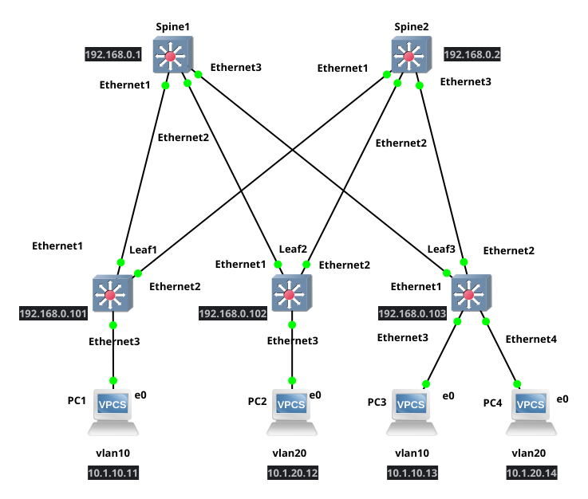

# HW5: EVPN L2VPN Configuration

## Описание

Данная конфигурация реализует EVPN (Ethernet VPN) поверх существующей underlay сети из HW4, обеспечивая L2 связность на уровне VPN между клиентскими устройствами.

## Топология



## Адресация клиентских устройств

| Устройство | Подключено к | VLAN | IP-адрес     | Маска подсети   | Gateway      |
|------------|--------------|------|--------------|-----------------|--------------|
| Сервер 1   | leaf1, Eth3  | 10   | 10.1.10.11   | 255.255.255.0   | 10.1.10.1    |
| Сервер 2   | leaf2, Eth3  | 20   | 10.1.20.12   | 255.255.255.0   | 10.1.20.1    |
| Сервер 3   | leaf3, Eth3  | 10   | 10.1.10.13   | 255.255.255.0   | 10.1.10.1    |
| Сервер 4   | leaf3, Eth4  | 20   | 10.1.20.14   | 255.255.255.0   | 10.1.20.1    |

## Underlay сеть (BGP)

### Адресация Loopback интерфейсов

| Устройство | Loopback0 (Router-ID) | Loopback1 (VTEP) |
|------------|-----------------------|------------------|
| spine1     | 192.168.0.1/32        | -                |
| spine2     | 192.168.0.2/32        | -                |
| leaf1      | 192.168.0.101/32      | 192.168.1.101/32 |
| leaf2      | 192.168.0.102/32      | 192.168.1.102/32 |
| leaf3      | 192.168.0.103/32      | 192.168.1.103/32 |

### P2P линки (Underlay)

| Линк              | Адрес spine | Адрес leaf   |
|-------------------|-------------|--------------|
| spine1 - leaf1    | 10.0.0.0/31 | 10.0.0.1/31  |
| spine1 - leaf2    | 10.0.0.2/31 | 10.0.0.3/31  |
| spine1 - leaf3    | 10.0.0.4/31 | 10.0.0.5/31  |
| spine2 - leaf1    | 10.0.0.6/31 | 10.0.0.7/31  |
| spine2 - leaf2    | 10.0.0.8/31 | 10.0.0.9/31  |
| spine2 - leaf3    | 10.0.0.10/31| 10.0.0.11/31 |

### BGP AS Numbers

| Устройство | AS Number |
|------------|-----------|
| spine1     | 65001     |
| spine2     | 65001     |
| leaf1      | 65011     |
| leaf2      | 65012     |
| leaf3      | 65013     |

## Overlay сеть (EVPN)

### VXLAN VNI Mapping

| VLAN | VNI   | Route Target | Описание                    |
|------|-------|--------------|----------------------------|
| 10   | 10010 | 1:10010      | Server1 (leaf1) + Server3 (leaf3) |
| 20   | 10020 | 1:10020      | Server2 (leaf2) + Server4 (leaf3)  |

### EVPN параметры

- **Протокол Overlay**: BGP EVPN (AFI/SAFI: L2VPN EVPN)
- **Underlay протокол**: BGP (eBGP)
- **VXLAN UDP порт**: 4789
- **Virtual Router MAC**: 00:00:00:00:00:01
- **Multihop**: 2 (для eBGP overlay сессий)

## Ключевые особенности конфигурации

### 1. Underlay BGP
- Используется eBGP для маршрутизации underlay
- Каждый leaf имеет свой AS (65011, 65012, 65013)
- Spine устройства используют общий AS 65001
- BFD включен для быстрого обнаружения отказов (300ms)
- Анонсируются Loopback0 и Loopback1 адреса

### 2. Overlay BGP EVPN
- Spine устройства выступают в роли EVPN Route Reflectors
- eBGP overlay сессии между leaf и spine (multihop 2)
- Source interface для overlay: Loopback0
- Extended communities включены для передачи EVPN атрибутов

### 3. VXLAN
- VTEP адреса назначены на Loopback1 интерфейсах leaf устройств
- Каждый VLAN маппится на уникальный VNI
- Используется стандартный VXLAN UDP порт 4789

### 4. L2VPN
- VLAN 10: связывает Server1 (leaf1) и Server3 (leaf3)
- VLAN 20: связывает Server2 (leaf2) и Server4 (leaf3)
- Anycast gateway (ip address virtual) обеспечивает единый шлюз для всех серверов в одном VLAN

### 5. Route Distinguisher и Route Target
- RD формат: `<Loopback0>:<VNI>`
  - leaf1 VLAN 10: 192.168.0.101:10010
  - leaf2 VLAN 20: 192.168.0.102:10020
  - leaf3 VLAN 10: 192.168.0.103:10010
  - leaf3 VLAN 20: 192.168.0.103:10020
- RT формат: `1:<VNI>` (одинаковый для всех участников VPN)

## Проверка работоспособности

### На Spine устройствах

```bash
# Проверка BGP соседей (underlay)
show ip bgp summary

# Проверка EVPN соседей (overlay)
show bgp evpn summary

# Проверка EVPN маршрутов
show bgp evpn
```

### На Leaf устройствах

```bash
# Проверка BGP соседей
show ip bgp summary
show bgp evpn summary

# Проверка VXLAN туннелей
show vxlan vtep
show vxlan vni

# Проверка EVPN маршрутов
show bgp evpn route-type mac-ip
show bgp evpn route-type imet

# Проверка MAC адресов
show vxlan address-table

# Проверка интерфейсов
show interfaces vxlan1
```

### Проверка связности

```bash
# С серверов
ping 10.1.10.1    # Gateway для VLAN 10
ping 10.1.20.1    # Gateway для VLAN 20

# Между серверами в одном VLAN
# Server1 (10.1.10.11) -> Server3 (10.1.10.13) в VLAN 10
ping 10.1.10.13

# Server2 (10.1.20.12) -> Server4 (10.1.20.14) в VLAN 20
ping 10.1.20.14
```

## Отличия от HW4

1. **Добавлен Loopback1** на leaf устройствах для VTEP адресов
2. **Изменена адресация клиентских сетей**:
   - VLAN 10: 10.1.10.0/24 (было 172.16.10.0/24 на leaf1)
   - VLAN 20: 10.1.20.0/24 (было 172.16.20.0/24 на leaf2 и 172.16.30.0/24 на leaf3)
3. **Изменено распределение VLAN**:
   - leaf1: VLAN 10 (без изменений)
   - leaf2: VLAN 20 (было VLAN 20)
   - leaf3: VLAN 10 + VLAN 20 (было только VLAN 30)
4. **Добавлен VXLAN интерфейс** на всех leaf устройствах
5. **Настроены BGP overlay сессии** между leaf и spine
6. **Включен EVPN address-family** в BGP
7. **Настроен anycast gateway** (ip address virtual)
8. **Добавлена конфигурация VLAN в BGP** с RD/RT
9. **Включен multi-agent routing protocol model** для поддержки EVPN

## Масштабируемость

Данная архитектура легко масштабируется:
- Добавление новых leaf коммутаторов требует только настройки BGP соседств
- Добавление новых VLAN/VNI требует конфигурации только на участвующих leaf устройствах
- Spine устройства автоматически распространяют EVPN маршруты между всеми leaf

## Отказоустойчивость

- Dual-homed подключение leaf к обоим spine обеспечивает избыточность
- BFD обеспечивает быструю детекцию отказов (300ms)
- BGP обеспечивает автоматическое переключение на резервные пути
- EVPN обеспечивает быструю конвергенцию при изменениях топологии

## Результаты диагностики

### 1. BGP Underlay на spine1

```
spine1# show ip bgp summary
BGP summary information for VRF default
Router identifier 192.168.0.1, local AS number 65001
  Description              Neighbor      V AS           MsgRcvd   MsgSent  InQ OutQ  Up/Down State   PfxRcd
  Link-to-leaf1            10.0.0.1      4 65011             45        46    0    0 00:33:18 Estab   2
  Link-to-leaf2            10.0.0.3      4 65012             48        47    0    0 00:34:04 Estab   2
  Link-to-leaf3            10.0.0.5      4 65013             47        47    0    0 00:34:03 Estab   2
```

**Статус**: Все underlay BGP сессии установлены (Estab). Каждый leaf анонсирует 2 префикса (Loopback0 и Loopback1).

### 2. BGP EVPN Overlay на spine1

```
spine1# show bgp evpn summary
BGP summary information for VRF default
Router identifier 192.168.0.1, local AS number 65001
  Description              Neighbor      V AS           MsgRcvd   MsgSent  InQ OutQ  Up/Down State   PfxRcd
  leaf1-overlay            192.168.0.101 4 65011             62        60    0    0 00:33:35 Estab   3
  leaf2-overlay            192.168.0.102 4 65012             62        60    0    0 00:34:22 Estab   4
  leaf3-overlay            192.168.0.103 4 65013             60        59    0    0 00:34:21 Estab   6
```

**Статус**: Все EVPN overlay сессии установлены. 
- leaf1: 3 префикса (1 IMET + 2 MAC-IP для VLAN 10)
- leaf2: 4 префикса (2 IMET + 2 MAC-IP для VLAN 20)
- leaf3: 6 префиксов (2 IMET + 4 MAC-IP для VLAN 10 и 20)

### 3. EVPN маршруты на spine1

```
spine1# show bgp evpn
```

**MAC-IP маршруты** (Type 2):
- `0050.7966.6800` / `10.1.10.11` → leaf1 (Server1, VLAN 10)
- `0050.7966.6801` / `10.1.20.13` → leaf2 (Server2, VLAN 20)
- `0050.7966.6802` / `10.1.10.12` → leaf3 (Server3, VLAN 10)
- `0050.7966.6803` / `10.1.20.14` → leaf3 (Server4, VLAN 20)

**IMET маршруты** (Type 3 - Inclusive Multicast Ethernet Tag):
- RD 192.168.0.101:10010 → VTEP 192.168.1.101 (leaf1, VLAN 10)
- RD 192.168.0.102:10010 → VTEP 192.168.1.102 (leaf2, VLAN 10)
- RD 192.168.0.102:10020 → VTEP 192.168.1.102 (leaf2, VLAN 20)
- RD 192.168.0.103:10010 → VTEP 192.168.1.103 (leaf3, VLAN 10)
- RD 192.168.0.103:10020 → VTEP 192.168.1.103 (leaf3, VLAN 20)

### 4. VXLAN туннели на leaf1

```
leaf1# show vxlan vtep
Remote VTEPS for Vxlan1:
VTEP                Tunnel Type(s)
192.168.1.102       flood
192.168.1.103       flood, unicast

Total number of remote VTEPS:  2
```

**Статус**: leaf1 установил VXLAN туннели к обоим удаленным VTEP:
- 192.168.1.102 (leaf2) - только flood (разные VLAN)
- 192.168.1.103 (leaf3) - flood + unicast (есть общий VLAN 10)

### 5. VNI маппинг на leaf3

```
leaf3# show vxlan vni
VNI to VLAN Mapping for Vxlan1
VNI         VLAN       Source       Interface       802.1Q Tag
10010       10         static       Ethernet3       untagged
                                    Vxlan1          10
10020       20         static       Ethernet4       untagged
                                    Vxlan1          20
```

**Статус**: На leaf3 корректно настроены оба VNI:
- VNI 10010 → VLAN 10 (Ethernet3 - Server3)
- VNI 10020 → VLAN 20 (Ethernet4 - Server4)

### 6. EVPN MAC-IP маршруты на leaf1

```
leaf1# show bgp evpn route-type mac-ip
```

**Статус**: leaf1 получил все MAC-IP маршруты от удаленных leaf через spine:
- Локальный: `0050.7966.6800` / `10.1.10.11` (Server1)
- От leaf2: `0050.7966.6801` / `10.1.20.13` (Server2, VLAN 20)
- От leaf3: `0050.7966.6802` / `10.1.10.12` (Server3, VLAN 10) - **ECMP**
- От leaf3: `0050.7966.6803` / `10.1.20.14` (Server4, VLAN 20) - **ECMP**

Маршруты от leaf3 имеют ECMP (Ec/ec), так как доступны через оба spine.

### 7. EVPN IMET маршруты на leaf1

```
leaf1# show bgp evpn route-type imet
```

**Статус**: leaf1 получил все IMET маршруты для построения flood списков:
- Локальный: RD 192.168.0.101:10010 (VLAN 10)
- От leaf2: RD 192.168.0.102:10010 и 10020 (VLAN 10 и 20) - **ECMP**
- От leaf3: RD 192.168.0.103:10010 и 10020 (VLAN 10 и 20) - **ECMP**

### 8. VXLAN MAC таблица на leaf3

```
leaf3# show vxlan address-table
VLAN  Mac Address     Type      Prt  VTEP             Moves   Last Move
10    0050.7966.6800  EVPN      Vx1  192.168.1.101    1       0:01:19 ago
20    0050.7966.6801  EVPN      Vx1  192.168.1.102    1       0:01:14 ago
```

**Статус**: leaf3 изучил MAC адреса удаленных серверов через EVPN:
- Server1 (VLAN 10) через VTEP 192.168.1.101 (leaf1)
- Server2 (VLAN 20) через VTEP 192.168.1.102 (leaf2)

### 9. VXLAN интерфейс на leaf3

```
leaf3# show interfaces vxlan1
Vxlan1 is up, line protocol is up (connected)
  Source interface is Loopback1 and is active with 192.168.1.103
  Listening on UDP port 4789
  Replication/Flood Mode is headend with Flood List Source: EVPN
  Remote MAC learning via EVPN
  VNI mapping to VLANs
  Static VLAN to VNI mapping is
    [10, 10010]       [20, 10020]
  Headend replication flood vtep list is:
    10 192.168.1.102   192.168.1.101
    20 192.168.1.102
```

**Статус**: VXLAN интерфейс работает корректно:
- Source: Loopback1 (192.168.1.103)
- Flood списки построены из EVPN IMET маршрутов
- VLAN 10: flood к 192.168.1.102 (leaf2) и 192.168.1.101 (leaf1)
- VLAN 20: flood к 192.168.1.102 (leaf2)

### 10. Тесты связности

**PC1 (10.1.10.11) → 10.1.10.12 - VLAN 10**:
```
PC1> ping 10.1.10.12
84 bytes from 10.1.10.12 icmp_seq=1 ttl=64 time=3.440 ms
84 bytes from 10.1.10.12 icmp_seq=2 ttl=64 time=2.342 ms
84 bytes from 10.1.10.12 icmp_seq=3 ttl=64 time=2.420 ms
84 bytes from 10.1.10.12 icmp_seq=4 ttl=64 time=2.254 ms
84 bytes from 10.1.10.12 icmp_seq=5 ttl=64 time=2.834 ms
```
✅ **Успешно**: L2 связность через VXLAN между устройствами в VLAN 10

**PC2 (10.1.20.13) → 10.1.20.14 - VLAN 20**:
```
PC2> ping 10.1.20.14
84 bytes from 10.1.20.14 icmp_seq=1 ttl=64 time=2.033 ms
84 bytes from 10.1.20.14 icmp_seq=2 ttl=64 time=2.830 ms
84 bytes from 10.1.20.14 icmp_seq=3 ttl=64 time=2.942 ms
84 bytes from 10.1.20.14 icmp_seq=4 ttl=64 time=2.583 ms
84 bytes from 10.1.20.14 icmp_seq=5 ttl=64 time=2.428 ms
```
✅ **Успешно**: L2 связность через VXLAN между устройствами в VLAN 20

**PC4 (VLAN 20) → 10.1.10.12 (VLAN 10)**:
```
PC4> ping 10.1.10.12
No gateway found
```
❌ **Ожидаемо**: Нет связности между разными VLAN (L2VPN изолирует трафик)

## Выводы по диагностике

1. ✅ **BGP Underlay**: Все сессии установлены, маршруты к Loopback адресам распространяются корректно
2. ✅ **BGP EVPN Overlay**: Все overlay сессии работают, EVPN маршруты обмениваются успешно
3. ✅ **VXLAN туннели**: Туннели установлены между всеми VTEP, используется headend replication
4. ✅ **MAC learning**: MAC адреса изучаются через EVPN (control plane learning)
5. ✅ **L2 связность**: Серверы в одном VLAN могут взаимодействовать через VXLAN
6. ✅ **L2 изоляция**: Серверы в разных VLAN изолированы друг от друга
7. ✅ **ECMP**: Маршруты через оба spine используются для балансировки нагрузки
8. ✅ **Flood списки**: Корректно построены из EVPN IMET маршрутов для BUM трафика
