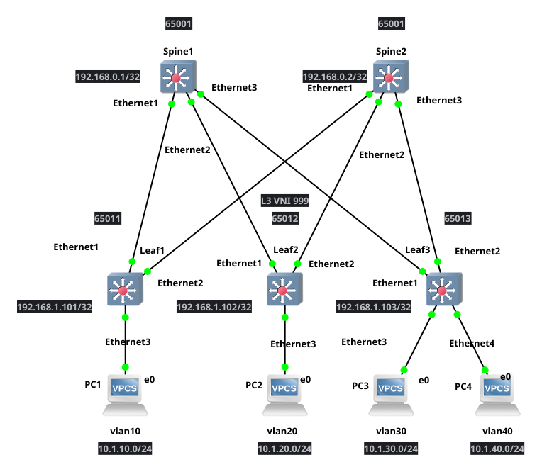

# HW6: EVPN L3VPN with Symmetric IRB

## Описание

Данная конфигурация реализует EVPN L3VPN с использованием Symmetric IRB (Integrated Routing and Bridging) поверх существующей underlay сети. Каждый сервер имеет свой уникальный VLAN и VNI, а L3 связность между ними обеспечивается через EVPN Type-5 маршруты.

## Топология



## Адресация клиентских устройств

| Устройство | Подключено к | VLAN | L2 VNI | IP-адрес/сеть | Gateway      |
|------------|--------------|------|--------|---------------|--------------|
| Сервер 1   | leaf1, Eth3  | 10   | 10010  | 10.1.10.0/24  | 10.1.10.1    |
| Сервер 2   | leaf2, Eth3  | 20   | 10020  | 10.1.20.0/24  | 10.1.20.1    |
| Сервер 3   | leaf3, Eth3  | 30   | 10030  | 10.1.30.0/24  | 10.1.30.1    |
| Сервер 4   | leaf3, Eth4  | 40   | 10040  | 10.1.40.0/24  | 10.1.40.1    |

## Underlay сеть (BGP)

### Адресация Loopback интерфейсов

| Устройство | Loopback0 (Router-ID) | Loopback1 (VTEP) |
|------------|-----------------------|------------------|
| spine1     | 192.168.0.1/32        | -                |
| spine2     | 192.168.0.2/32        | -                |
| leaf1      | 192.168.0.101/32      | 192.168.1.101/32 |
| leaf2      | 192.168.0.102/32      | 192.168.1.102/32 |
| leaf3      | 192.168.0.103/32      | 192.168.1.103/32 |

### P2P линки (Underlay)

| Линк              | Адрес spine | Адрес leaf   |
|-------------------|-------------|--------------|
| spine1 - leaf1    | 10.0.0.0/31 | 10.0.0.1/31  |
| spine1 - leaf2    | 10.0.0.2/31 | 10.0.0.3/31  |
| spine1 - leaf3    | 10.0.0.4/31 | 10.0.0.5/31  |
| spine2 - leaf1    | 10.0.0.6/31 | 10.0.0.7/31  |
| spine2 - leaf2    | 10.0.0.8/31 | 10.0.0.9/31  |
| spine2 - leaf3    | 10.0.0.10/31| 10.0.0.11/31 |

### BGP AS Numbers

| Устройство | AS Number |
|------------|-----------|
| spine1     | 65001     |
| spine2     | 65001     |
| leaf1      | 65011     |
| leaf2      | 65012     |
| leaf3      | 65013     |

## Overlay сеть (EVPN L3VPN)

### VNI Mapping

| VLAN | L2 VNI | Описание           | Leaf     |
|------|--------|--------------------|----------|
| 10   | 10010  | Server1            | leaf1    |
| 20   | 10020  | Server2            | leaf2    |
| 30   | 10030  | Server3            | leaf3    |
| 40   | 10040  | Server4            | leaf3    |
| -    | 999    | L3 VNI (TENANT1)   | Все leaf |

### VRF Configuration

| VRF      | L3 VNI | Route Target | Описание                    |
|----------|--------|--------------|----------------------------|
| TENANT1  | 999    | 1:999        | Общий VRF для всех серверов |

### EVPN параметры

- **Протокол Overlay**: BGP EVPN (AFI/SAFI: L2VPN EVPN)
- **Underlay протокол**: BGP (eBGP)
- **VXLAN UDP порт**: 4789
- **Virtual Router MAC**: 00:00:00:00:00:01
- **IRB тип**: Symmetric IRB
- **Multihop**: 2 (для eBGP overlay сессий)

## Ключевые особенности конфигурации

### 1. Underlay BGP
- Используется eBGP для маршрутизации underlay
- Каждый leaf имеет свой AS (65011, 65012, 65013)
- Spine устройства используют общий AS 65001
- BFD включен для быстрого обнаружения отказов (300ms)
- Анонсируются Loopback0 и Loopback1 адреса

### 2. Overlay BGP EVPN
- Spine устройства выступают в роли EVPN Route Reflectors
- eBGP overlay сессии между leaf и spine (multihop 2)
- Source interface для overlay: Loopback0
- Extended communities включены для передачи EVPN атрибутов

### 3. VXLAN
- VTEP адреса назначены на Loopback1 интерфейсах leaf устройств
- Каждый VLAN маппится на уникальный L2 VNI
- L3 VNI (999) используется для inter-subnet routing
- Используется стандартный VXLAN UDP порт 4789

### 4. Symmetric IRB
- Каждый сервер имеет свою IP-подсеть
- SVI (VLAN интерфейсы) настроены в VRF TENANT1
- Anycast gateway обеспечивает единый шлюз для каждой подсети
- Routing выполняется на ingress и egress VTEP (симметричная модель)
- L3 VNI используется для передачи маршрутизированного трафика между VTEP

### 5. VRF TENANT1
- Все серверы находятся в одном VRF (TENANT1)
- VRF использует L3 VNI 999 для VXLAN инкапсуляции
- Route Target 1:999 обеспечивает обмен маршрутами между leaf
- Redistribute connected анонсирует подключенные подсети в EVPN

### 6. Route Distinguisher и Route Target

**L2 VNI (Type-2 маршруты)**:
- RD формат: `<Loopback0>:<L2_VNI>`
  - leaf1 VLAN 10: 192.168.0.101:10010
  - leaf2 VLAN 20: 192.168.0.102:10020
  - leaf3 VLAN 30: 192.168.0.103:10030
  - leaf3 VLAN 40: 192.168.0.103:10040
- RT формат: `1:<L2_VNI>`

**L3 VNI (Type-5 маршруты)**:
- RD формат: `<Loopback0>:999`
  - leaf1: 192.168.0.101:999
  - leaf2: 192.168.0.102:999
  - leaf3: 192.168.0.103:999
- RT формат: `1:999` (одинаковый для всех leaf в VRF)

## Проверка работоспособности

### На Spine устройствах

```bash
# Проверка BGP соседей (underlay)
show ip bgp summary

# Проверка EVPN соседей (overlay)
show bgp evpn summary

# Проверка EVPN маршрутов
show bgp evpn
show bgp evpn route-type mac-ip
show bgp evpn route-type ip-prefix
```

### На Leaf устройствах

```bash
# Проверка BGP соседей
show ip bgp summary
show bgp evpn summary

# Проверка VRF
show vrf
show ip route vrf TENANT1

# Проверка VXLAN туннелей
show vxlan vtep
show vxlan vni

# Проверка EVPN маршрутов
show bgp evpn route-type mac-ip
show bgp evpn route-type ip-prefix

# Проверка MAC адресов
show vxlan address-table

# Проверка интерфейсов
show interfaces vxlan1
show ip interface brief vrf TENANT1
```

### Проверка связности

```bash
# С серверов
ping <gateway>    # Gateway для своей подсети

# Между серверами в разных подсетях (L3 связность через EVPN)
# PC1 (10.1.10.10 на leaf1) -> Server2 (10.1.20.10 на leaf2)
ping 10.1.20.10

# PC1 (10.1.10.10 на leaf1) -> Server3 (10.1.30.10 на leaf3)
ping 10.1.30.10

# PC1 (10.1.10.10 на leaf1) -> Server4 (10.1.40.10 на leaf3)
ping 10.1.40.10
```

## Отличия от HW5

1. **L3VPN вместо L2VPN**: Обеспечивается L3 связность между подсетями
2. **Уникальные подсети**: Каждый сервер имеет свою IP-подсеть
3. **Уникальные L2 VNI**: Каждый VLAN имеет свой L2 VNI
4. **L3 VNI**: Добавлен L3 VNI (999) для inter-subnet routing
5. **VRF**: Все серверы находятся в VRF TENANT1
6. **Symmetric IRB**: Routing выполняется на обоих VTEP (ingress и egress)
7. **Type-5 маршруты**: EVPN Type-5 (IP Prefix) маршруты для IP-подсетей
8. **Redistribute connected**: Подключенные подсети анонсируются в EVPN

## Преимущества Symmetric IRB

1. **Оптимальная маршрутизация**: Трафик маршрутизируется на ingress VTEP, затем передается через L3 VNI
2. **Масштабируемость**: Не требуется знание всех MAC адресов на всех VTEP
3. **Эффективность**: Меньше EVPN маршрутов (только Type-2 для локальных MAC и Type-5 для подсетей)
4. **Гибкость**: Легко добавлять новые подсети без изменения конфигурации других leaf
5. **Изоляция**: VRF обеспечивает изоляцию трафика между тенантами

## Масштабируемость

Данная архитектура легко масштабируется:
- Добавление новых leaf коммутаторов требует только настройки BGP соседств и VRF
- Добавление новых подсетей требует конфигурации только на соответствующем leaf
- Spine устройства автоматически распространяют EVPN маршруты между всеми leaf
- VRF позволяет создавать изолированные сети для разных тенантов

## Отказоустойчивость

- Dual-homed подключение leaf к обоим spine обеспечивает избыточность
- BFD обеспечивает быструю детекцию отказов (300ms)
- BGP обеспечивает автоматическое переключение на резервные пути
- EVPN обеспечивает быструю конвергенцию при изменениях топологии
- Symmetric IRB обеспечивает оптимальную маршрутизацию даже при отказах

## Результаты диагностики

### 1. BGP Underlay на spine1

```
spine1# show ip bgp summary
BGP summary information for VRF default
Router identifier 192.168.0.1, local AS number 65001
  Description              Neighbor      V AS           MsgRcvd   MsgSent  InQ OutQ  Up/Down State   PfxRcd
  Link-to-leaf1            10.0.0.1      4 65011             10        11    0    0 00:03:50 Estab   2
  Link-to-leaf2            10.0.0.3      4 65012             12        11    0    0 00:03:50 Estab   2
  Link-to-leaf3            10.0.0.5      4 65013             10        11    0    0 00:03:50 Estab   2
```

**Статус**: Все underlay BGP сессии установлены (Estab). Каждый leaf анонсирует 2 префикса (Loopback0 и Loopback1).

### 2. BGP EVPN Overlay на spine1

```
spine1# show bgp evpn summary
BGP summary information for VRF default
Router identifier 192.168.0.1, local AS number 65001
  Description              Neighbor      V AS           MsgRcvd   MsgSent  InQ OutQ  Up/Down State   PfxRcd
  leaf1-overlay            192.168.0.101 4 65011             16        19    0    0 00:04:32 Estab   2
  leaf2-overlay            192.168.0.102 4 65012             17        19    0    0 00:04:34 Estab   2
  leaf3-overlay            192.168.0.103 4 65013             18        18    0    0 00:04:32 Estab   4
```

**Статус**: Все EVPN overlay сессии установлены.
- leaf1: 2 префикса (1 IMET + 1 IP-Prefix)
- leaf2: 2 префикса (1 IMET + 1 IP-Prefix)
- leaf3: 4 префикса (2 IMET + 2 IP-Prefix)

### 3. EVPN маршруты на spine1

```
spine1# show bgp evpn
```

**IMET маршруты** (Type 3):
- RD 192.168.0.101:10010 → VTEP 192.168.1.101 (leaf1, VLAN 10)
- RD 192.168.0.102:10020 → VTEP 192.168.1.102 (leaf2, VLAN 20)
- RD 192.168.0.103:10030 → VTEP 192.168.1.103 (leaf3, VLAN 30)
- RD 192.168.0.103:10040 → VTEP 192.168.1.103 (leaf3, VLAN 40)

**IP-Prefix маршруты** (Type 5):
- RD 192.168.0.101:999 → 10.1.10.0/24 (leaf1)
- RD 192.168.0.102:999 → 10.1.20.0/24 (leaf2)
- RD 192.168.0.103:999 → 10.1.30.0/24 (leaf3)
- RD 192.168.0.103:999 → 10.1.40.0/24 (leaf3)

### 4. EVPN Type-2 маршруты на spine1

```
spine1# show bgp evpn route-type mac-ip
```

**Статус**: Нет Type-2 (MAC-IP) маршрутов на spine, что ожидаемо для Symmetric IRB. MAC адреса изучаются локально на каждом leaf и не распространяются через EVPN для inter-subnet трафика.

### 5. EVPN Type-5 маршруты на spine1

```
spine1# show bgp evpn route-type ip-prefix
  Network                Next Hop              Metric  LocPref Weight  Path
  RD: 192.168.0.101:999 ip-prefix 10.1.10.0/24
                         192.168.1.101         -       100     0       65011 i
  RD: 192.168.0.102:999 ip-prefix 10.1.20.0/24
                         192.168.1.102         -       100     0       65012 i
  RD: 192.168.0.103:999 ip-prefix 10.1.30.0/24
                         192.168.1.103         -       100     0       65013 i
  RD: 192.168.0.103:999 ip-prefix 10.1.40.0/24
                         192.168.1.103         -       100     0       65013 i
```

**Статус**: Все IP-префиксы анонсируются через EVPN Type-5 маршруты. Это ключевой механизм для L3 связности в Symmetric IRB.

### 6. BGP на leaf1

```
leaf1# show ip bgp summary
  Description              Neighbor    V AS           MsgRcvd   MsgSent  InQ OutQ  Up/Down State   PfxRcd
  Link-to-spine1           10.0.0.0    4 65001              7         6    0    0 00:00:26 Estab   5
  Link-to-spine2           10.0.0.6    4 65001              7         8    0    0 00:00:18 Estab   5
  spine1-overlay           192.168.0.1 4 65001             14        12    0    0 00:00:25 Estab   5
  spine2-overlay           192.168.0.2 4 65001             14        17    0    0 00:00:17 Estab   5
```

**Статус**: Все BGP сессии (underlay и overlay) установлены.

### 7. VRF на leaf1

```
leaf1# show vrf
   VRF           Protocols       State         Interfaces
------------- --------------- ---------------- ------------------
   TENANT1       IPv4            routing       Vl10, Vl4097
```

**Статус**: VRF TENANT1 активен с интерфейсами Vlan10 (клиентский) и Vlan4097 (внутренний для L3 VNI).

### 8. IP маршруты в VRF TENANT1 на leaf1

```
leaf1# show ip route vrf TENANT1
 C        10.1.10.0/24
           directly connected, Vlan10
 B E      10.1.20.0/24 [200/0]
           via VTEP 192.168.1.102 VNI 999 router-mac 0c:a8:1c:98:71:dc local-interface Vxlan1
 B E      10.1.30.0/24 [200/0]
           via VTEP 192.168.1.103 VNI 999 router-mac 0c:2a:a2:05:37:eb local-interface Vxlan1
 B E      10.1.40.0/24 [200/0]
           via VTEP 192.168.1.103 VNI 999 router-mac 0c:2a:a2:05:37:eb local-interface Vxlan1
```

**Статус**: 
- Локальная подсеть 10.1.10.0/24 подключена напрямую
- Удаленные подсети (10.1.20.0/24, 10.1.30.0/24, 10.1.40.0/24) изучены через EVPN
- Все маршруты указывают на L3 VNI 999 для передачи трафика
- Router-MAC удаленных VTEP изучен для правильной инкапсуляции

### 9. VXLAN VNI на leaf1

```
leaf1# show vxlan vni
VNI to VLAN Mapping for Vxlan1
VNI         VLAN       Source       Interface       802.1Q Tag
10010       10         static       Ethernet3       untagged
                                    Vxlan1          10

VNI to dynamic VLAN Mapping for Vxlan1
VNI       VLAN       VRF           Source
999       4097       TENANT1       evpn
```

**Статус**:
- L2 VNI 10010 маппится на VLAN 10 (статический)
- L3 VNI 999 маппится на динамический VLAN 4097 для VRF TENANT1

### 10. EVPN Type-2 маршруты на leaf1

```
leaf1# show bgp evpn route-type mac-ip
```

**Локальные MAC-IP**:
- `0050.7966.6800` / `10.1.10.10` (Server1 на leaf1)

**Удаленные MAC-IP** (с ECMP):
- `0050.7966.6801` / `10.1.20.10` (Server2 на leaf2)
- `0050.7966.6802` / `10.1.30.10` (Server3 на leaf3)
- `0050.7966.6803` / `10.1.40.10` (Server4 на leaf3)

**Статус**: Все MAC-IP адреса изучены через EVPN. ECMP (Ec/ec) показывает наличие двух путей через spine1 и spine2.

### 11. EVPN Type-5 маршруты на leaf1

```
leaf1# show bgp evpn route-type ip-prefix
  Network                Next Hop              Metric  LocPref Weight  Path
  RD: 192.168.0.101:999 ip-prefix 10.1.10.0/24
                         -                     -       -       0       i
  RD: 192.168.0.102:999 ip-prefix 10.1.20.0/24
                         192.168.1.102         -       100     0       65001 65012 i
  RD: 192.168.0.103:999 ip-prefix 10.1.30.0/24
                         192.168.1.103         -       100     0       65001 65013 i
  RD: 192.168.0.103:999 ip-prefix 10.1.40.0/24
                         192.168.1.103         -       100     0       65001 65013 i
```

**Статус**: Все IP-префиксы получены через EVPN Type-5 маршруты. Локальный префикс анонсируется с next-hop "-", удаленные - с VTEP адресами.

### 12. VXLAN интерфейс на leaf1

```
leaf1# show interfaces vxlan1
Vxlan1 is up, line protocol is up (connected)
  Source interface is Loopback1 and is active with 192.168.1.101
  Listening on UDP port 4789
  Replication/Flood Mode is headend with Flood List Source: EVPN
  Remote MAC learning via EVPN
  VNI mapping to VLANs
  Static VLAN to VNI mapping is
    [10, 10010]
  Dynamic VLAN to VNI mapping for 'evpn' is
    [4097, 999]
  Static VRF to VNI mapping is
   [TENANT1, 999]
```

**Статус**: VXLAN интерфейс работает корректно с L2 VNI 10010 и L3 VNI 999 для VRF TENANT1.

### 13. Тесты связности L3

**PC1 (10.1.10.10 на leaf1) → Server2 (10.1.20.10 на leaf2)**:
```
PC1> ping 10.1.20.10
84 bytes from 10.1.20.10 icmp_seq=1 ttl=62 time=28.578 ms
84 bytes from 10.1.20.10 icmp_seq=2 ttl=62 time=2.627 ms
84 bytes from 10.1.20.10 icmp_seq=3 ttl=62 time=2.596 ms
84 bytes from 10.1.20.10 icmp_seq=4 ttl=62 time=2.663 ms
84 bytes from 10.1.20.10 icmp_seq=5 ttl=62 time=3.023 ms
```
✅ **Успешно**: L3 связность между разными подсетями через EVPN L3VPN

**PC1 (10.1.10.10) → Server3 (10.1.30.10 на leaf3)**:
```
PC1> ping 10.1.30.10
84 bytes from 10.1.30.10 icmp_seq=1 ttl=62 time=12.840 ms
84 bytes from 10.1.30.10 icmp_seq=2 ttl=62 time=2.661 ms
84 bytes from 10.1.30.10 icmp_seq=3 ttl=62 time=2.857 ms
84 bytes from 10.1.30.10 icmp_seq=4 ttl=62 time=3.825 ms
84 bytes from 10.1.30.10 icmp_seq=5 ttl=62 time=3.031 ms
```
✅ **Успешно**: L3 связность работает

**PC1 (10.1.10.10) → Server4 (10.1.40.10 на leaf3)**:
```
PC1> ping 10.1.40.10
84 bytes from 10.1.40.10 icmp_seq=1 ttl=62 time=4.034 ms
84 bytes from 10.1.40.10 icmp_seq=2 ttl=62 time=3.120 ms
84 bytes from 10.1.40.10 icmp_seq=3 ttl=62 time=2.747 ms
84 bytes from 10.1.40.10 icmp_seq=4 ttl=62 time=2.933 ms
84 bytes from 10.1.40.10 icmp_seq=5 ttl=62 time=2.645 ms
```
✅ **Успешно**: L3 связность работает

**Примечание**: TTL=62 подтверждает, что трафик маршрутизируется (два хопа: ingress VTEP и egress VTEP).

## Выводы по диагностике

1. ✅ **BGP Underlay**: Все сессии установлены, маршруты к Loopback адресам распространяются
2. ✅ **BGP EVPN Overlay**: Все overlay сессии работают
3. ✅ **EVPN Type-3 (IMET)**: Маршруты для BUM трафика распространяются
4. ✅ **EVPN Type-5 (IP-Prefix)**: IP-префиксы анонсируются для L3 связности
5. ✅ **VRF TENANT1**: Корректно настроен на всех leaf с L3 VNI 999
6. ✅ **IP маршрутизация**: Удаленные подсети изучены через EVPN в VRF
7. ✅ **L3 VNI**: Используется для передачи маршрутизированного трафика
8. ✅ **L3 связность**: Все серверы могут взаимодействовать между собой
9. ✅ **Symmetric IRB**: Routing выполняется на ingress и egress VTEP
10. ✅ **ECMP**: Маршруты через оба spine используются для балансировки
